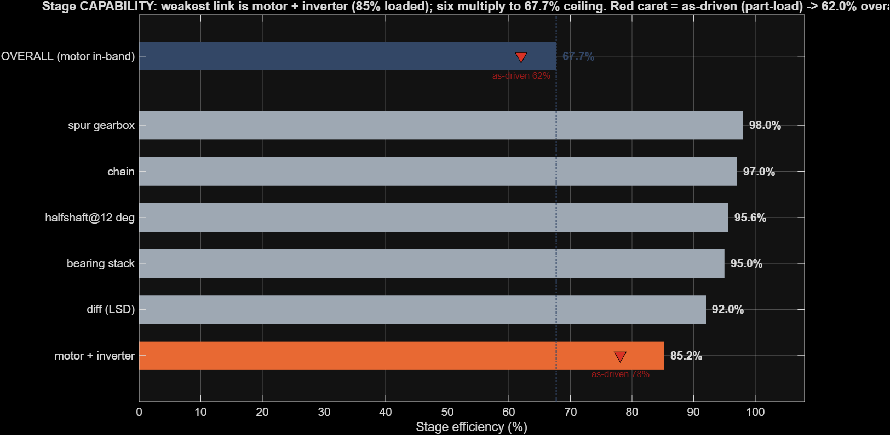

# CFR27 Powertrain Sim

MATLAB + Python model for CFR27: final-drive gear ratio,
drivetrain efficiency, acceleration, battery/SOC, and driveline loads.

This model takes actual data from the car and works out where the drivetrain throws
energy away between the battery and the ground, stage by stage. It then uses the same
logged laps to ask what a different final drive would have cost or saved, so the ratio
choice is a measurement argument instead of a vibe. Two things it's for: picking a final
drive that trades endurance efficiency against lap pace, and pricing hardware changes
(halfshaft angle, diff, chain, bearings) in efficiency and battery Wh.

> **New here / just want to run something?** See **[HOW_TO_USE.md](HOW_TO_USE.md)**,
> a task-first cheat sheet ("I want to know X → run this → look here"). This page
> is the full install + background.



*Every stage on the same axis, weakest link at the bottom. Six stages multiply to a
67.7% ceiling; the red carets are what the endurance lap actually delivered (62.0%).
The gap between them is part-load operating cost, not broken hardware.*

---

## Inputs vs outputs

**What goes in:**

| Input | Where from |
|---|---|
| Motor torque + power curve, phase R, Kt, core-loss coefficients | EMRAX 208 HV datasheet |
| Tyre radius, mass, weight distribution, CG height | scales + tilt test |
| Gear teeth / candidate ratios | the actual gearsets we can buy |
| Telemetry CSVs (motor rpm, torque feedback, pack V/I, wheel speeds, odo) | comp June 19 + June 20, July 11 test day |
| Aero drag + downforce | Ford wind tunnel + aero lead's CFD |
| Cell OCV + 2-RC parameter tables | our own HPPC cell test |

**What comes out:**

| Output | Script |
|---|---|
| Battery→ground efficiency %, broken down per stage | `drivetrain_efficiency.m` |
| Energy per endurance lap, battery Wh saved per design lever | `drivetrain_efficiency.m` |
| Motor+inverter efficiency vs gear ratio, ranked | `gear_ratio_optimization.m` |
| Pack SOC over a run (coulomb counting + 2-RC + Kalman) | `gear_ratio_optimization.m` |
| 0–75 m, 0–100 kph, trap speed vs ratio | `accel_model.m` |
| Driveline torque spectra (fatigue load cases) | `fatigue_spectrum.m`, `accel_fatigue.m` |

---

## Install on Windows

You need this once. Takes ~10 minutes.

### 1. Requirements

| Tool | Why | Notes |
|---|---|---|
| **MATLAB** (R2024a or newer; built on R2026a) | runs all the `.m` scripts | **base MATLAB is enough** for every `.m` script. **Simulink** is only needed if you want to open `accel_sim.slx`. |
| **Git** ([git-scm.com](https://git-scm.com/download/win)) | to clone + pull updates | Git GUI or command line, either works. |
| **Python 3** ([python.org](https://www.python.org/downloads/windows/)) | only for pulling NEW telemetry | **Optional.** The repo already ships the telemetry CSVs, so you can run every analysis without Python. |

> Tick **"Add Python to PATH"** in the Python installer if you'll use the telemetry exporter.

### 2. Get the code

**Option A, Git (recommended, so you can pull updates):**
```powershell
cd %USERPROFILE%\Documents
git clone https://github.com/Alr0611/CFR-dt-sim.git
cd CFR-dt-sim
```
That drops the repo in `Documents\CFR-dt-sim`.

**Option B, no Git:** on the GitHub page click **Code ▸ Download ZIP**, then extract it anywhere.

### 3. Run the MATLAB scripts

1. Open MATLAB.
2. **File ▸ Open** → pick `START.m` from the repo folder.
3. Hit **Run** (green ▶, or F5).

`START.m` finds itself, sets every path, and prints the menu. **No "Current Folder" fiddling.**
Then type any script name at the MATLAB prompt, e.g.:

```matlab
drivetrain_efficiency     % battery->ground efficiency + every design lever
gear_ratio_optimization   % the main study: efficiency + pack charge sweep (dashboard + op-points map)
accel_model               % accel: 0-75m, 0-100kph, tyre-weight sensitivity
verify_math               % checks the scripts still work: recomputes everything from params_cfr26
```

More:
```matlab
open_system('accel_sim')  % the accel model in Simulink (needs Simulink)
fatigue_spectrum          % endurance driveline torque spectrum
accel_fatigue             % accel spectrum, the one that fatigues the driveline
brake_analysis            % friction/no-regen energy check
efficiency_crosscheck     % physics model vs MEASURED efficiency
```

Figures and CSVs land in `output/`.

### 4. (Optional) Pull fresh telemetry from the car

Only if you want new data. The repo already has the CSVs the scripts use.

```powershell
cd CFR-dt-sim\tools
python export_influx_chunked.py
```
It's guided: paste your Influx API token once (it's saved, gitignored), type a Montreal
time range off your phone, pick channels by subsystem. First run auto-installs its one
dependency. **You must be on Carputer's network** for it to reach the box.
Then `convert_to_matlab.py` turns any export into a `.mat`/CSV the scripts read.

### Troubleshooting

- **"Undefined function" / scripts can't find each other** → you didn't start from `START.m`. Open and run it first; it sets the paths.
- **MATLAB license error in the terminal** (`matlab -batch`) → run scripts from the open MATLAB desktop instead; batch-mode licensing can be flaky.
- **`python` not recognized** → reinstall Python with "Add to PATH" ticked, or use `py` instead of `python`.

---

## The goal here
What final drive best balances **motor efficiency**, **endurance pack charge**, and
**acceleration**? We currently run **4.61:1**. The sweep covers **4.00–5.20**.

Read these as "which direction is better", not as exact numbers.

- **Efficiency + pack charge want a LOWER ratio (~4.2).** More drive energy stays in the
  motor's efficient band, and the pack ends endurance with a bit more left.
- **Acceleration wants a HIGHER ratio (~5.2)**; gearing down to 4.2 costs ~0.19 s over 75 m
  in the current model.
- **4.61 is the compromise** (why CFR24 moved 5.2 → 4.61); **4.3–4.5 is the more balanced region.**

If we go 4.2, a **21T/38T** gearbox on the existing chain gets 4.17, and the gears come out
stronger than what we run now.

**Drivetrain efficiency:** `drivetrain_efficiency.m` builds the whole battery→ground
stack: motor+inverter (MEASURED from telemetry) × gearbox × bearings × chain × diff ×
halfshaft angle, and prices every design lever in efficiency and battery Wh. Headline:
the halfshafts run at 12° static (measured), which alone costs ~2.4% of drivetrain
efficiency vs straight; getting them to 0–5° is free endurance range.

## Two different efficiency numbers live in this repo

Worth knowing which one you're using, because they don't match and they aren't
independent:

- **`drivetrain_efficiency.m` uses the MEASURED number (~0.86 pack→shaft).** That's
  mechanical power out ÷ electrical power in, i.e. (motor torque × motor speed) ÷ (pack
  voltage × pack current), energy-weighted over the motoring points of a run.
- **`gear_ratio_optimization.m` uses the PHYSICS model (~0.90)**: `emrax208_efficiency`
  (copper + core loss off the datasheet) × `p.eta_inverter = 0.95`.
- **They agree because they were made to.** `eta_inverter = 0.95` was picked so the
  physics model would land on the measured number. So "the model matches the
  measurement" is a calibration, not a validation. A dyno pull is what would check it
  properly.
- **And "MEASURED" is doing some work in that word.** The torque channel
  (`PM100DX_torqueFeedback`) is the *inverter's own estimate* of torque, from measured
  current run through its internal motor model, not a torque transducer. So the
  mechanical side of the measurement is partly model-derived, and shares assumptions
  (notably Kt) with the physics model it gets compared to.

Use MEASURED for absolute battery→ground claims; use the physics model for *ranking*
ratios, where a uniform factor cancels out anyway.

## Layout

```
START.m                  open this, hit Run: sets paths, prints the menu
params_cfr26.m           every constant, with a comment saying where it came from
drivetrain_efficiency.m  battery->ground efficiency + design levers
gear_ratio_optimization.m  the main ratio study
accel_model.m            acceleration study (+ accel_sim.slx in Simulink)
verify_math.m            checks the scripts still work
EQUATIONS.md             every equation in the repo, with symbols and where it lives
lib/                     shared physics (motor eff, tyre mu, peak torque, RC battery model)
analysis/                measured-efficiency-map tools
data/                    the telemetry CSVs the scripts read
docs/                    figures embedded in this README
tools/                   InfluxDB exporter + CSV->MATLAB converter
output/                  generated results (gitignored)
```

## Where the numbers come from

| | |
|---|---|
| Efficiency / operating points | comp June 20 endurance (real race pace) |
| Pack charge + battery validation | July 11; a complete run, comp DNF'd |
| Accel validation | comp June 19 launches, real 0-75 m = 4.40 s at 4.61 |
| Drivetrain efficiency stack | CFR26 DT efficiency memo v4.0 + measured telemetry |
| Aero | Ford wind tunnel (downforce) + aero lead (drag) |
| Chassis | tilt test, with driver |
| Motor / cells | EMRAX 208 datasheet / HPPC test + ESF |
| Tyre | TTC Pacejka file (lateral only; see Warnings) |

## How much to trust it

- Battery model tracks the real pack to **~6 mV/cell** over 80 minutes.
- Motor efficiency is built from datasheet physics and lands on the datasheet's ~96% peak
  by itself, then takes an inverter haircut to the real ~86–90%. Never curve-fitted.
  See the two-efficiency-numbers section above for what that haircut actually is.
- Accel model says 4.67 s where the real launch was **4.40 s**, i.e. the sim is 0.27 s
  conservative.
- Starting SOC from rest voltage (94.7%) matches the BMS (94.3%).
- `verify_math.m`: **48 checks, all pass in R2026a.**

## `verify_math.m` validates that the scripts work properly

It re-derives the load-bearing numbers from scratch and shouts if one stops matching. Its
job is to stop someone editing a constant and quietly changing a conclusion three files
away. It loads `params_cfr26()` and tests against `p.*` throughout, so a parameter edit
can't move every result in the repo while this still prints PASS all the way down.

## Warnings

- **Tyre longitudinal grip is derived, not measured.** Calspan never tested this tyre for
  forward grip, because ours was too small. The sideways numbers are real test data; the
  forward ones are a well-dressed estimate.
